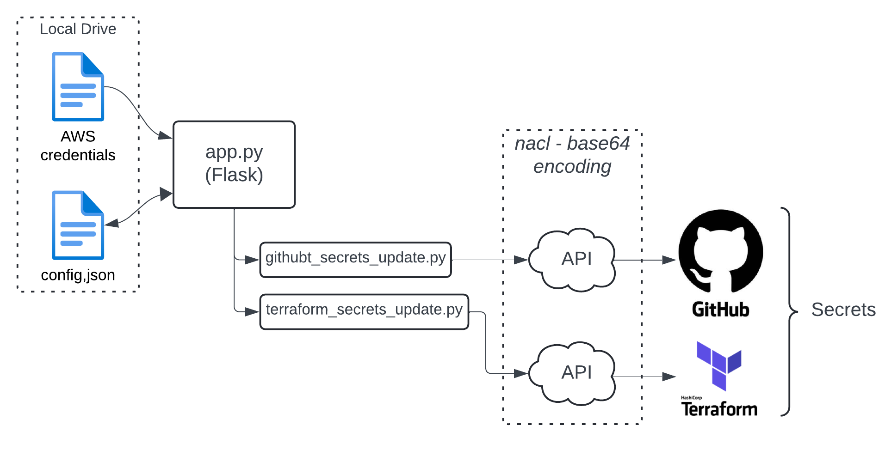
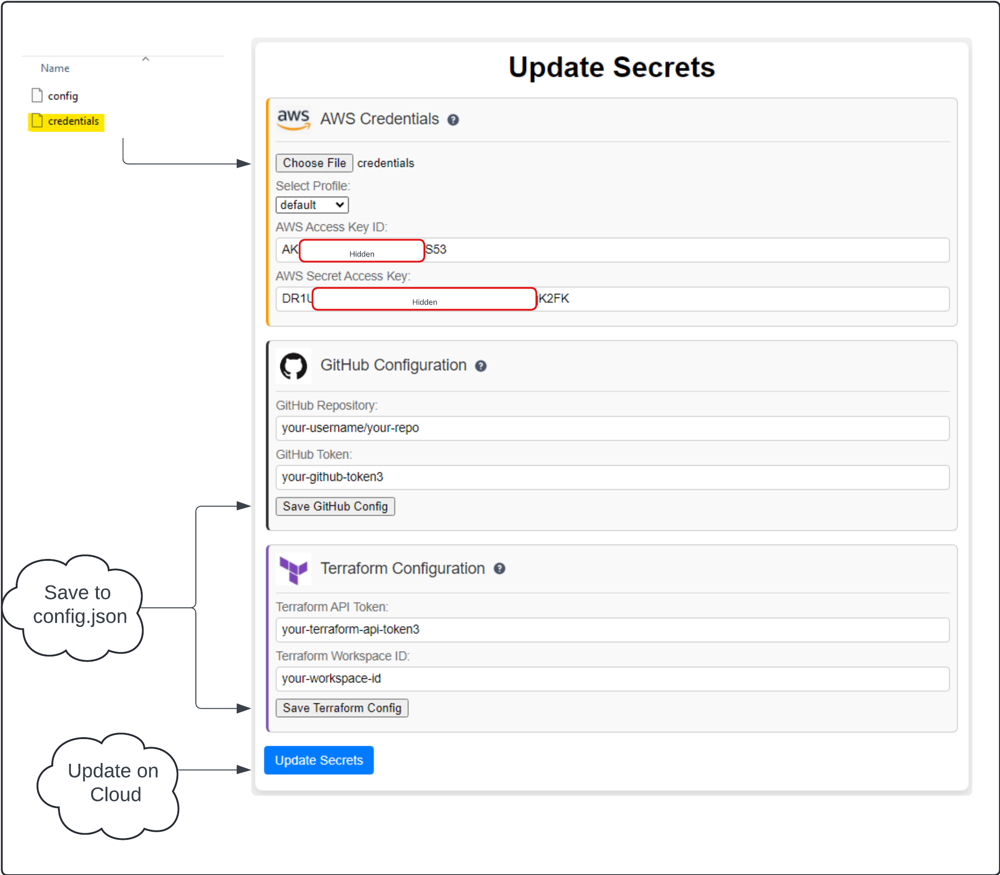

# Secrets Update Script

## Overview

The Secrets Update Script is a web-based tool built with Flask that facilitates the updating of sensitive secrets for GitHub and Terraform. This application allows you to manage and update AWS credentials, GitHub secrets, and Terraform variables through a user-friendly web interface.

<div align="center">

</div>

## Features

- **AWS Secrets Management**: Update AWS Access_Key_ID and Secret_Access_Key.
- **GitHub Secrets Update**: Securely update GitHub repository secrets using GitHub's API.
- **Terraform Variables Management**: Update Terraform environment variables with sensitive data.
- **Configuration Management**: Save and load configuration settings for GitHub and Terraform.

## Directory Structure

- **`app.py`**: Main Flask application file.
- **`config.json`**: Created on first launch, it is the configuration file storing credentials and tokens (GIT/Terraform).
- **`file_tools.py`**: Utility functions for loading and saving the configuration file (Defaults on first launch of the appliction are here).
- **`github_secrets_update.py`**: Script for updating GitHub repository secrets.
- **`terraform_secrets_update.py`**: Script for updating Terraform variables.
- **`static/`**: Directory containing static files like CSS, JavaScript, and images.
- **`templates/`**: Directory containing HTML templates.

## How It Works

<div align="center">

</div>

1. **Run the Application**: Execute `app.py` to start the Flask web server. 
2. **Configuration**: On the first launch, ensure correct GitHub/Terraform is credentials are entered and 'save'.
3. **Update Secrets**:
   - Navigate to the web interface and input the new AWS credentials.
4. **Manage Configurations**:
   - Use the provided forms to save configurations for GitHub and Terraform.
   - Changes are saved and reflected in `config.json`.
5. **Update Secrets**
   - Click the "Update Secrets" button to apply changes.
## Dependencies

- Flask
- Requests
- PyNaCl (for GitHub secret encryption)

Install dependencies via:

```bash
pip install -r requirements.txt
